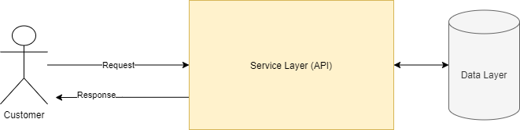
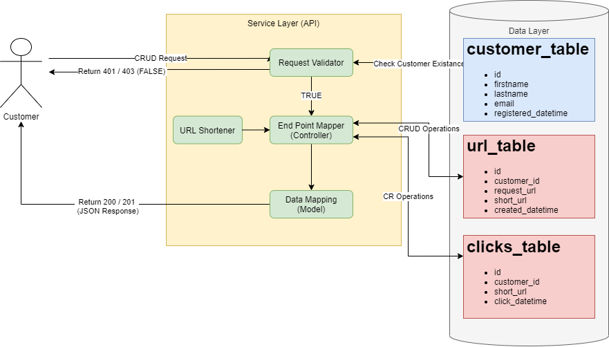
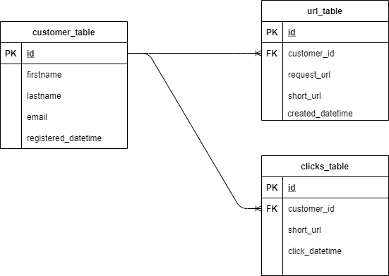

# Backend-Link-Shortener
Design of a link shortening API service

## Design





## Requirements

This section covers the components featuring in the design section, and explains what the reponsibility of each module is, how it can be broken down into smaller development 'chunks', feature some examples how these will be implemented, and finally give an estimate on the amount of work needed.

### RDBMS Tables

Two tables will be required for this service.



Assuming syntax dialect is Postgres Dialect:

```
CREATE TABLE customer_table (
    id                   integer,
    firstname            varchar(100),
    lastname             varchar(100),
    email                varchar(100),
    registered_datetime  timestamp DEFAULT current_timestamp,
    CONSTRAINT customer_pk PRIMARY KEY(customer_id)
);

CREATE TABLE url_table (
    id                 integer,
    customer_id        integer,
    request_url        varchar(4000),
    short_url          varchar(100),
    created_datetime   timestamp DEFAULT current_timestamp,
    CONSTRAINT url_pk PRIMARY KEY(id),
    CONSTRAINT fk_url_customer FOREIGN KEY(customer_id) REFERENCES customer_table(id)
);

CREATE TABLE clicks_table (
    id               integer,
    customer_id      integer,
    short_url        varchar(100),
    click_datetime   timestamp DEFAULT current_timestamp,
    CONSTRAINT clicks_pk PRIMARY KEY(id),
    CONSTRAINT fk_clicks_customer FOREIGN KEY(customer_id) REFERENCES customer_table(id)
);
```

### Data Models

At least 2 model classes are required to match the RDBMS table setup. 
Assuming syntax dialect is Java:

```
public class customer{
    private Long id;
    private String firstname;
    private String lastname;
    private String email;
    private DateTime registered_datetime;

    // Constructor (or builder pattern equivalent)

    // Setters

    // Getters

    // Additional Methods (toString, toHash, getFullName, etc)
}

public class url{
    private Long id;
    private Long customer_id;
    private String request_url;
    private String short_url;
    private DateTime created_datetime;

    // Constructor (or builder pattern equivalent)

    // Setters

    // Getters

    // Additional Methods (toString, toHash, etc)
}
```

### URL Shortener

The url shortener module is a stateless function which takes two inputs (Customer ID + URL) and outputs the shortened link. We will treat this function as a blackbox, however it's signature will look like this.

```
public static String shortenUrl(String inputUrl, String customerId){
    return  md5HashCalc(inputUrl, customerId)  // Function is a placeholder for the actual shortening of the url, together with the customerId.
}
```

Given that each shortened url must be unique per customer, the function also accepts a second input parameter denoting the customer id. With both the customer id and the input url, we can assume that the function will compute a unique hash on these two values together,


### Request Validator

The validator module receives the OAuth token from the incoming customer API requests (sent as part of the Header), and uses it to authorize / authenticate the customer in before the resource endpoint can be accessed. The purpose of the token is 3 fold:

* Authenticate the user, and verify that he can access the endpoints available within the API.
* Authorize the user, in case certain endpoints have higher privilege access compared to others.
* Get the customer_id, which we will used in the endpoint mappings below to verify that a customer_id exists when matching for urls.

### End Point Mappings (Controllers)

The API service will consist of the following REST endpoints:

* /create - POST (Customer sends input URL through the request body, and response will be a 201 if the create was successful.)
  * Check database if the "customer_id" and "url" values combination exists.
    * If doesn't exist:
      - Call shortener module and generate shortened url.
      - Insert a new record into table 'url_table'.
      - Return 201, signifying status created.
    * If exists:
      - Insert a new record into table 'clicks_table'.
      - Do a GET request on "url".
      - Retrieve "url" response HTML / JSON / XML from 3rd party, and return it to the customer with status code 200. Else return a 301. 

  API Request eg: https://lin.ks/ - POST

  SQL eg: insert into url_table values (?,?,?,?,?);

* /update/{shortUrl} - PUT (Customer sends input URL through the request body, and response will be a 201 if the update was successful.)
  * Check database if the "customer_id" and "{shortUrl}" values combination exists.
  * If exists:
    - Call shortener module and generate shortened url based off the request body "url" value.
    - Update the record in table 'url_table'.
    - Return 204, signifying status successful (No Content). 

  API Request eg: https://lin.ks/xCd5a - PUT

  SQL eg: update url_table set request_url=?new where customer_id=? and short_url=?;

* /delete/{shortUrl} - DELETE (Deletes based off the "customer_id" and "short_url" values combination).
  * Check database if the "customer_id" and "short_url" values combination exists.
  * If exists:
    - Delete record from database.
    - Return 204, signifying status successful  (No Content).

  API Request eg: https://lin.ks/xCd5a - DELETE

  SQL eg: delete from url_table where customer_id=? and short_url=?;

* /retrieve/{shortUrl} - GET (Customer gets redirected to the original url based of the shortened version passed as part of this GET request).
  * Insert a new record into table 'clicks_table'.
  * Check database if the "customer_id" and "{shortUrl}" values combination exists.
  * If exists: 
    - Retrieve the "request_url" from table "url_table", where "customer_id" and "short_url" match this request.
    - Do a GET request on the retrieved "request_url".
    - Retrieve "request_url" response HTML / JSON / XML from 3rd party, and return it to the customer with status code 200. Else return a 301.

  API Request eg: https://lin.ks/xCd5a - GET

  SQL eg: select request_url from url_table where customer_id=? and short_url=?;

* /getTotalNumberOfClicks - GET (Retrieves total number of clicks)
  * Run count against database.
  * Return count with status code 200.

  API Request eg: https://lin.ks/gettotalnumberofclicks - GET

  SQL eg: select count(*) from clicks_table;

* /getNumberOfClicksByDay - GET (Retrieves number of clicks by day.)
  * Run count aggregation against database.
  * Return count with status code 200.

  API Request eg: https://lin.ks/getnumberofclicksbyday - GET

  SQL eg: select count(*), trunc(click_datetime) from clicks_table group by trunc(click_datetime);

* /getTotalNumberOfPeopleWhoClickedLinks - GET (Retrieves total number of people who clicked links.)
  * Run count aggregation against database.
  * Return count with status code 200.

  API Request eg: https://lin.ks/gettotalnumberofpeoplewhoclickedlinks - GET

  SQL eg: select count(*) from ( select distinct customer_id from clicks_table) a;

* /getTotalNumberOfPeopleWhoClickedByDay - GET (Retrieves total number of people who clicked by day.)
  * Run count aggregation against database.
  * Return count with status code 200.

  API Request eg: https://lin.ks/gettotalnumberofpeoplewhoclickedbyday - GET

  SQL eg: select count(*), trunc(click_datetime) from ( select distinct customer_id, trunc(click_datetime) from clicks_table) a group by trunc(click_datetime);


Sample controller (pseudocode example to show how this will work):

```
@GetMapping("/{shortUrl}")
@ResponseBody
public ResponseEntity<?> retrieve(@RequestHeader("Authorization") String token,
                                  @PathVariable String shortUrl){

    String customerId = getCustomerIdFromToken(token);  // A method which parses the token and retrieves customerId.

    clicksTableService.insert(customerId, shortUrl, DateTime.now());  // DB Service - Logs the url click into table 'clicks_table'.

    String requestUrl = urlTableService.getRequestUrl(customerId, shortUrl);  // DB Service - returns the original url for a customerId + shortUrl combination

    if (requestUrl != "" || requestUrl != null){
        URL obj = new URL(requestUrl);
        HttpsURLConnection response = (HttpsURLConnection) obj.openConnection();
        return ResponseEntity.status(HttpStatus.OK).body(response.getBody());
    }else
        return ResponseEntity.status(HttpStatus.NOT_FOUND).body("not found!");


}
```